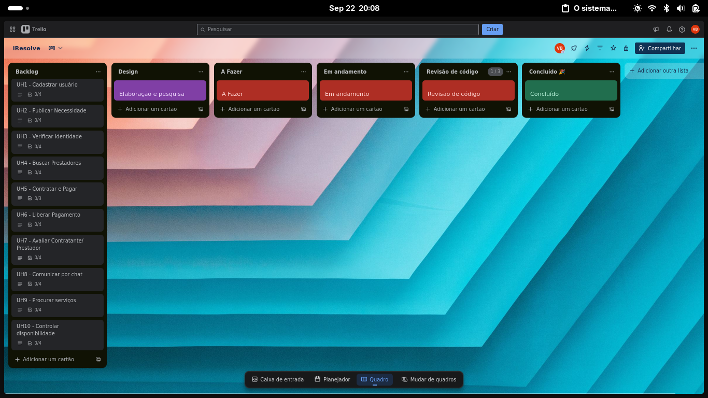

#  iResolve
## Sumário
[Descrição](#descricao)  
[Time](#time)  
[Trello](#trello)  

## Descrição
_**ODS 1:** Erradicação da Pobreza  
**1.4** Até 2030, garantir que todos os homens e mulheres, particularmente os pobres e vulneráveis, tenham direitos iguais aos recursos econômicos, bem como o acesso a serviços básicos, propriedade e controle sobre a terra e outras formas de propriedade, herança, recursos naturais, novas tecnologias apropriadas e serviços financeiros, incluindo microfinanças_

O Resolve no Bairro (iResolve) é uma plataforma de micro-trabalhos, desenhada para criar um ecossistema de serviços seguro e eficiente dentro de uma mesma comunidade. A ideia é formalizar e potencializar o famoso "boca a boca", permitindo que quem precisa de um serviço encontre rapidamente um prestador confiável no seu próprio bairro/município, e quem tem uma habilidade possa gerar renda de forma flexível.
### Público-Alvo:
Prestadores de Serviço: Trabalhadores informais, desempregados, aposentados, estudantes e qualquer pessoa com uma habilidade que queira uma fonte de renda extra.
### Contratantes: 
Moradores do bairro, pequenos comércios, escritórios e famílias que precisam de serviços pontuais e rápidos.
### Funcionalidades Chave:
#### Perfil Verificado do Prestador:
O prestador cria um perfil simples com foto, uma breve descrição de suas habilidades e o(s) bairro(s) que atende.
Um sistema de verificação de identidade (upload de documento) e antecedentes (opcional, mas recomendado) confere um "Selo de Confiança" ao perfil.
A principal funcionalidade é o sistema de avaliações e comentários de clientes anteriores, que constrói a reputação do profissional na plataforma.
#### Mural de Oportunidades ("Classificados do Bairro"):
O contratante posta a necessidade: "Preciso de alguém para passear com meu cachorro amanhã de manhã em Boa Viagem. Ofereço R$ 30".
Prestadores interessados e qualificados podem se candidatar ou enviar uma proposta pelo chat.
#### Busca Ativa por Habilidade:
O contratante pode buscar diretamente: "manicure no Espinheiro" ou "eletricista em Afogados". A plataforma mostra uma lista de prestadores, ordenados por reputação e proximidade.
#### Chat e Pagamento Seguro Integrado:
Um chat interno para combinar detalhes e valores.
O pagamento é feito via plataforma (PIX ou cartão). O valor fica retido em escrow (garantia) e só é liberado para o prestador quando o contratante marca o serviço como "concluído". Isso garante segurança para ambos.
Modelo de Sustentabilidade: O modelo se baseia em uma pequena e transparente taxa de serviço (ex: 7% a 10%) sobre o valor de cada transação. Essa taxa é significativamente menor que a de grandes aplicativos de gig economy e serve para manter a plataforma, o suporte e o sistema de pagamentos seguros.  
*Parcerias com centros comunitários (Compaz) para cadastrar e treinar prestadores também seriam uma via de crescimento.

## Time
[Vinicius Gabriel](https://github.com/gitviini/)  
[Matheus de Freitas](https://github.com/matheusprojects)  
[Marcos Fraga](https://github.com/MarcTony0)  

## Trello

