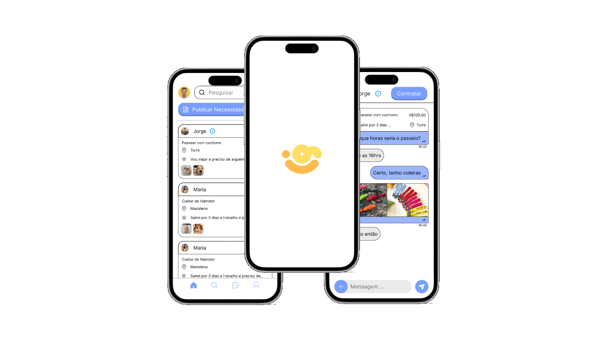
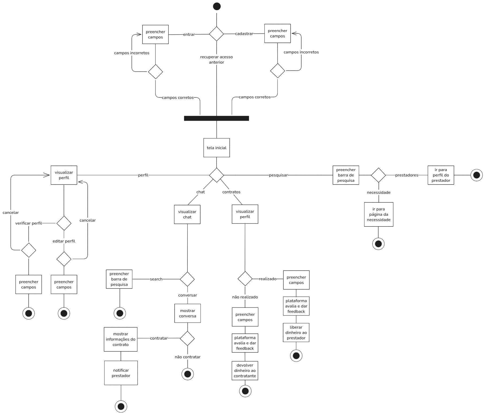
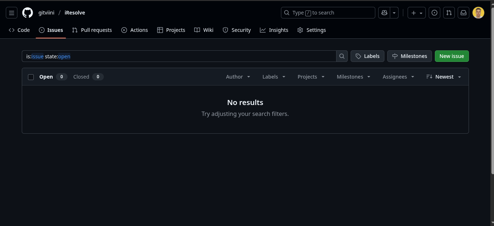
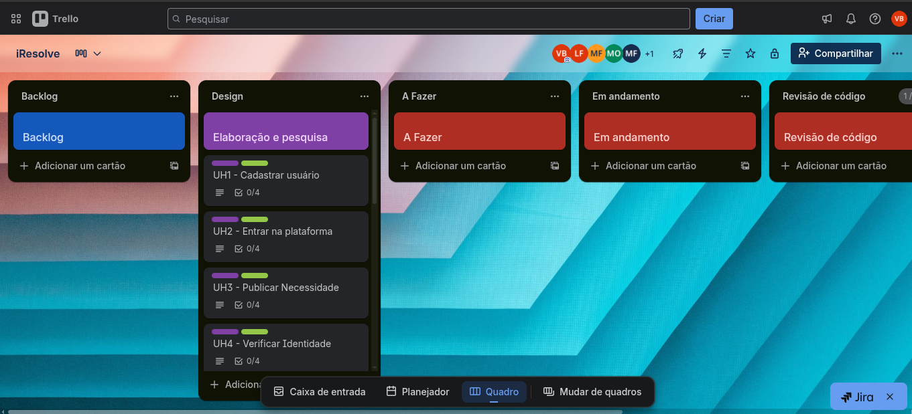

    

<b>iResolve</b>

## :bookmark_tabs: Sumário
[:bookmark: Descrição](#bookmark-descrição)  
[:busts_in_silhouette: Time](#busts_in_silhouette-time)  
[:play_or_pause_button: Screencast](#play_or_pause_button-screencast)  
[:chart_with_downwards_trend: Diagrama de atividades](#chart_with_downwards_trend-diagrama-de-atividades)  
[:bar_chart: Trello](#bar_chart-trello)  
[:scroll: Dev Documentation](#scroll-dev-documentation)  

## :bookmark: Descrição
O iResolve é uma plataforma de micro-trabalhos, desenhada para criar um ecossistema de serviços seguro e eficiente dentro de uma mesma comunidade. A ideia é formalizar e potencializar o famoso "boca a boca", permitindo que quem precisa de um serviço encontre rapidamente um prestador confiável no seu próprio bairro/município, e quem tem uma habilidade possa gerar renda de forma flexível.  
[↪ Descrição completa](DESCRIPTION.md)

## :busts_in_silhouette: Time
[🧑🏽🗣️ Vinicius Gabriel](https://github.com/gitviini/)  
[🧑🏾🕹️ Matheus de Freitas](https://github.com/matheusprojects)  
[🧑🏻💻 Marcos Fraga](https://github.com/MarcTony0)  

## :play_or_pause_button: Screencast

## :chart_with_downwards_trend: Diagrama de atividades

## :bug: Issue/Bug tracker

## :bar_chart: Trello
link: [trello iResolve](https://trello.com/invite/b/68d1d3b16aae0205c2c07d29/ATTIb0afe195adb4e00e5b0fb60bbca4226d9C51A98A/iresolve)

## :scroll: Dev Documentation
link: [Documentação do projeto](https://docs.google.com/document/d/1f4NxQz_QvtPDz8-lhgybyDI0kk3L76br2evO7AL-GtA/edit?usp=sharing)
